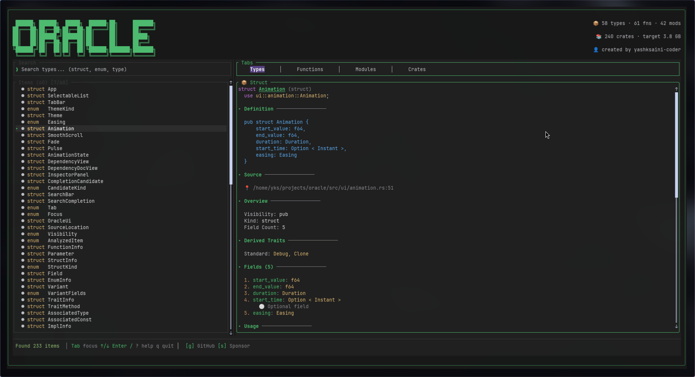
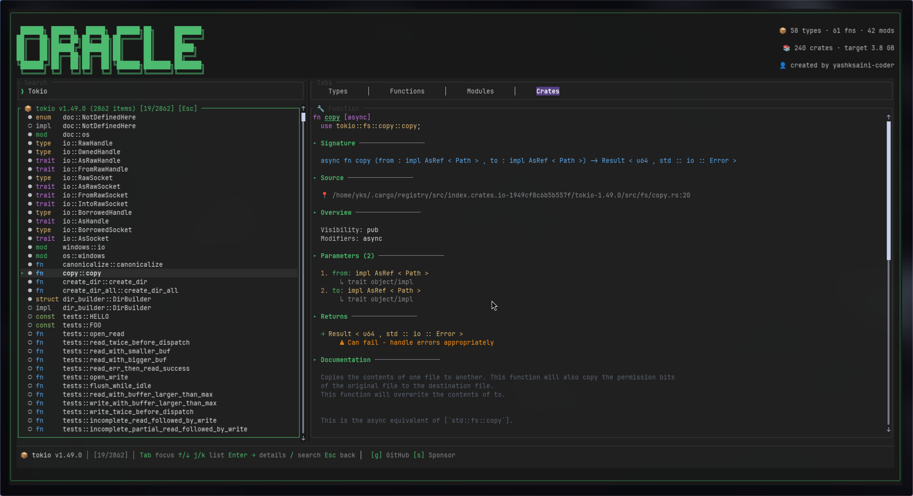

# 🔮 Oracle

**A blazing-fast Rust code inspector for the terminal**

<div align="center">

[](https://github.com/yashksaini-coder/oracle/actions/workflows/ci.yml)
[](https://github.com/yashksaini-coder/oracle/blob/main/LICENSE)
[](https://crates.io/crates/oracle-tui)
[](https://www.rust-lang.org/)

</div>

---

Oracle is a terminal-based application for exploring Rust codebases. It parses your Rust source files and provides an interactive interface to browse functions, structs, enums, traits, and more — all without leaving your terminal.

Built with [Ratatui](https://ratatui.rs) for a smooth, responsive TUI experience.

[](https://ratatui.rs/)


## ✨ Features

- **📦 Code Analysis** — Parses Rust source files using `syn`:
  - Functions (parameters, return types, async/const/unsafe)
  - Structs (fields, derives, generics)
  - Enums (variants with all field types)
  - Traits (methods, associated types, supertraits)
  - Impl blocks (inherent and trait implementations)
  - Modules, Type aliases, Constants, Statics

- **🔍 Smart Search** — Fuzzy matching with real-time filtering
- **📋 Dependency Analysis** — Visualize `Cargo.toml` dependencies
- **🎨 Multiple Themes** — Default Dark, Nord, Catppuccin Mocha, Dracula
- **⚡ Smooth Animations** — Selection highlights, tab transitions
- **⌨️ Vim-style Navigation** — `j/k` for movement, `/` for search




## 📦 Installation

### From crates.io (recommended)

With Rust and Cargo installed:

```bash
cargo install oracle-tui
```

The binary is still named `oracle`; run it with `oracle`.

### From source

```bash
git clone https://github.com/yashksaini-coder/oracle.git
cd oracle
cargo install --path .
# or: make install
```

### Pre-built binaries

See [Releases](https://github.com/yashksaini-coder/oracle/releases) for Linux (x86_64), macOS (x86_64, Apple Silicon), and Windows (x86_64) binaries.

## 🚀 Usage


```bash
# Cd into the project directory
cd path/to/rust-project
# Analyze current directory (must be a Cargo project root or folder with .rs files)
oracle
```

## ⌨️ Keyboard Shortcuts

| Key | Action |
|-----|--------|
| **Focus & panels** | |
| `Tab` / `Shift+Tab` | Next / previous panel (search → list → inspector) |
| `/` | Focus search |
| `Esc` | Clear search, back to list, or close popup |
| **List & inspector** | |
| `↑` / `↓` or `j` / `k` | Move selection / scroll inspector |
| `Enter` / `→` / `l` | Open item / focus inspector |
| `←` / `h` | Back to list (e.g. exit crate view) |
| `Home` | First item |
| `G` / `End` | Last item |
| `PgUp` / `PgDn` | Page up / down |
| **Tabs** | |
| `1` `2` `3` `4` | Types · Functions · Modules · Crates |
| **Crates tab only** | |
| `o` | Open docs.rs in browser |
| `c` | Open crates.io in browser |
| **Other** | |
| `C` | Open Copilot chat (ask about current item) |
| `t` | Cycle theme |
| `S` | Settings overlay |
| `?` | Toggle help |
| `q` / `Esc` | Quit |
| **Links** | |
| `g` | Open GitHub repo in browser |
| `s` | Open Sponsor page in browser |

## 🛠️ Development

```bash
# See all commands
make

# Install development tools
make dev-setup

# Full check (format, lint, typecheck)
make check

# Run linter
make lint

# Run tests
make test

# Build release
make release
```

## 📤 Releasing (maintainers)

- **Publish to crates.io** (after `cargo login`): `make publish-dry-run` then `make publish`. The crate is published as **oracle-tui** (the name "oracle" is taken by another project on crates.io).
- **GitHub Release**: Push a version tag (e.g. `v0.1.0`). The [release workflow](.github/workflows/release.yml) builds binaries for Linux, macOS (Intel + Apple Silicon), and Windows and creates a release. Optionally set `CARGO_REGISTRY_TOKEN` in repo secrets to auto-publish to crates.io on tag push.

## 🤝 Contributing

Contributions are welcome! Please feel free to submit a Pull Request.

1. Fork the repository
2. Create your feature branch (`git checkout -b feat/amazing-feature`)
3. Commit your changes using [Conventional Commits](https://www.conventionalcommits.org/)
4. Push to the branch (`git push origin feat/amazing-feature`)
5. Open a Pull Request

### Commit Convention

We use [Conventional Commits](https://www.conventionalcommits.org/). Examples:

- `feat: add new search feature`
- `fix: correct parsing error`
- `docs: update README`
- `refactor!: change API structure` (breaking change)

## 📄 License

This project is licensed under the [MIT License](LICENSE).

---